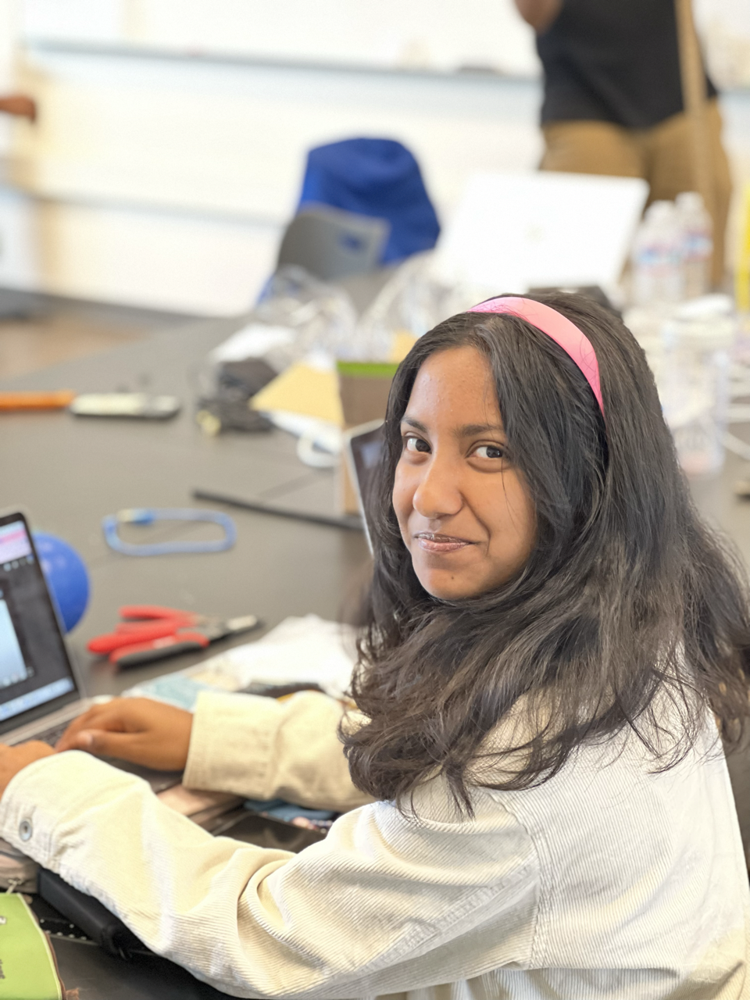

# Knee Rehab and Activity Monitor with Bluetooth
<!--- Replace this text with a brief description (2-3 sentences) of your project. This description should draw the reader in and make them interested in what you've built. You can include what the biggest challenges, takeaways, and triumphs from completing the project were. As you complete your portfolio, remember your audience is less familiar than you are with all that your project entails! -->

| **Engineer** | **School** | **Area of Interest** | **Grade** |
|:--:|:--:|:--:|:--:|
| Shefali G | Lynbrook High School | Electrical Engineering | Rising Junior


<!---  -->

  
<!--- Final Milestone
For your final milestone, explain the outcome of your project. Key details to include are:
- What you've accomplished since your previous milestone
- What your biggest challenges and triumphs were at BSE
- A summary of key topics you learned about
- What you hope to learn in the future after everything you've learned at BSE-->

<!--- Don't forget to replace the text below with the embedding for your milestone video. Go to Youtube, click Share - Embed, and copy and paste the code to replace what's below.-->

<!--- Second Milestone
For your second milestone, explain what you've worked on since your previous milestone. You can highlight:
- Technical details of what you've accomplished and how they contribute to the final goal
- What has been surprising about the project so far
- Previous challenges you faced that you overcame
- What needs to be completed before your final milestone -->

<!--- Don't forget to replace the text below with the embedding for your milestone video. Go to Youtube, click Share - Embed, and copy and paste the code to replace what's below. -->

# First Milestone

<iframe width="560" height="315" src="https://www.youtube.com/embed/rf7adFBhlLM" title="YouTube video player" frameborder="0" allow="accelerometer; autoplay; clipboard-write; encrypted-media; gyroscope; picture-in-picture; web-share" allowfullscreen></iframe>

My first step was to create my own bend sensor by attaching a piece of velostat (pressure-resistance material) in between two pieces of neoprene (fabric) sewed with conductive thread to create a pressure sensor. The more pressure was applied to the sensor, the lower the resistance became. However, the range of resistance changed often, so calibrating the resistance to match the bend angle was too time-consuming. Because of this, I changed the sensor to a flex sensor where its resistance increases as it bends.
To measure the resistance of the bend sensor, I created a circuit with a static resistor and the flex sensor, which is a variable resistor. By measuring the voltage between a known resistance and the unknown resistance, I was able to find the resistance of the flex sensor.
Next, I translated the amount of resistance to the angle of bend of the resistor. I recorded how the resistance varied when bending, and I was able to determine how much change in the resistance correlated with the bend of the sensor. This step was relatively simple due to how the resistance remained stable and consistent when compared to the sensor that I previously made. 
My next step was to add a buzzer to go off when the bend of the resistor went past a certain angle. After doing some research, it seems like the bend of the knee should not go past 90, so I set my buzzer to alert the user of that. However, I am planning to do more research on the proper form of the knee to adjust my program.
I also was able to send information to the Arduino from a smartphone using a Bluetooth module, but I am planning to expand on this with my next milestone.
My next steps will be connecting the Arduino with a smartphone or computer through a Bluetooth module to send information and learning how to integrate an accelerometer into the circuit.
I am planning to try to calibrate my self-made bend sensor again at the end of the project.
My main challenges for this milestone were calibrating the bend sensor and creating the pressure (bend) sensor. 

# Starter Project

<iframe width="560" height="315" src="https://www.youtube.com/embed/IEwls6huYKY" title="YouTube video player" frameborder="0" allow="accelerometer; autoplay; clipboard-write; encrypted-media; gyroscope; picture-in-picture; web-share" allowfullscreen></iframe>

For my starter project, I built the TV-B-Gone remote that has the ability to turn most TVs on and off. This happens through the wavelengths emitted by the four infrared LEDs on the front of the remote. Their wavelength is 940nm, and their varying range and output allow them to match the wavelengths needed to turn off most TVs. The button on the remote resets the microcontroller, meaning that all the code stored in the microcontroller is run when the button is pressed. To control the timings of the release of wavelengths from the IR LEDs, an 8.0MHz resonator is used. This is important because a specific sequence of pulses sends the "on" or "off" signal to the TV. Transistors are used to amplify the current supplied by the microcontroller to the amount needed by the LEDs. This remote is powered by two AA batteries that provide three volts together. The challenges that I faced while building this project were being unfamiliar with the tools needed, such as a soldering iron, a desoldering pump, and a tool needed to remove insulation for the wire. However, this project allowed me to become comfortable using these tools, and my remote now successfully turns on and off my home TV!

<!--Schematics 
Here's where you'll put images of your schematics. [Tinkercad](https://www.tinkercad.com/blog/official-guide-to-tinkercad-circuits) and [Fritzing](https://fritzing.org/learning/) are both great resoruces to create professional schematic diagrams, though BSE recommends Tinkercad becuase it can be done easily and for free in the browser.-->

<!--Code
Here's where you'll put your code. The syntax below places it into a block of code. Follow the guide [here]([url](https://www.markdownguide.org/extended-syntax/)) to learn how to customize it to your project needs.-->

<!--```c++
void setup() {
  // put your setup code here, to run once:
  Serial.begin(9600);
  Serial.println("Hello World!");
}-->


<!--Bill of Materials
Here's where you'll list the parts in your project. To add more rows, just copy and paste the example rows below.
Don't forget to place the link of where to buy each component inside the quotation marks in the corresponding row after href =. Follow the guide [here]([url](https://www.markdownguide.org/extended-syntax/)) to learn how to customize this to your project needs.-->

<!--| **Part** | **Note** | **Price** | **Link** |
|:--:|:--:|:--:|:--:|
| Item Name | What the item is used for | $Price | <a href="https://www.amazon.com/Arduino-A000066-ARDUINO-UNO-R3/dp/B008GRTSV6/"> Link </a> |
|:--:|:--:|:--:|:--:|
| Item Name | What the item is used for | $Price | <a href="https://www.amazon.com/Arduino-A000066-ARDUINO-UNO-R3/dp/B008GRTSV6/"> Link </a> |
|:--:|:--:|:--:|:--:|
| Item Name | What the item is used for | $Price | <a href="https://www.amazon.com/Arduino-A000066-ARDUINO-UNO-R3/dp/B008GRTSV6/"> Link </a> |
|:--:|:--:|:--:|:--:|-->

<!--Other Resources/Examples
One of the best parts about Github is that you can view how other people set up their own work. Here are some past BSE portfolios that are awesome examples. You can view how they set up their portfolio, and you can view their index.md files to understand how they implemented different portfolio components.
- [Example 1](https://trashytuber.github.io/YimingJiaBlueStamp/)
- [Example 2](https://sviatil0.github.io/Sviatoslav_BSE/)
- [Example 3](https://arneshkumar.github.io/arneshbluestamp/)

To watch the BSE tutorial on how to create a portfolio, click here.-->
