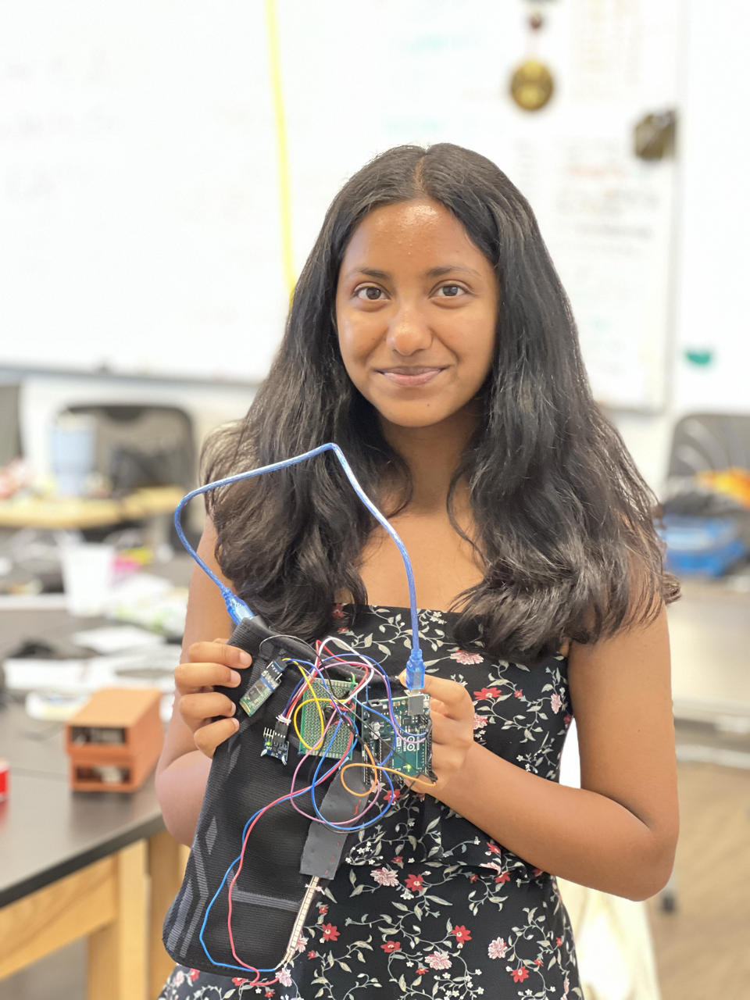
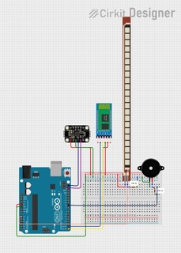

# Knee Rehab and Activity Monitor with Bluetooth

My project is a knee brace that uses sensors to track the user's movements and alerts them of incorrect form when doing exercise that could impact their knee. This knee brace specifically monitors squats by using an accelerometer and flex sensor that measures the angle of bend, acceleration, and angular velocity  of the knee. The brace will send data to the user's laptop for the user to view information about their knee. 

| **Engineer** | **School** | **Area of Interest** | **Grade** |
|:--:|:--:|:--:|:--:|
| Shefali G | Lynbrook High School | Electrical Engineering | Rising Junior



# Third Milestone

<iframe width="560" height="315" src="https://www.youtube.com/embed/WzPNAynZCQo" title="YouTube video player" frameborder="0" allow="accelerometer; autoplay; clipboard-write; encrypted-media; gyroscope; picture-in-picture; web-share" allowfullscreen></iframe>

The final part of my project was to program the Arduino to distinguish between good and bad squat forms. My first step was to learn what mistakes I should be looking for while squatting. After searching on the internet, I decided to focus on detecting when the user's knees were bending inwards and when the user squatted down instead of backward. These increase force on the knee, which is unsafe. 

Next, I formatted my code to print out accelerometer values in a way that would be easy to convert into a spreadsheet- brackets around every six values and commas in between each value (x acceleration, y acceleration, z acceleration, x rotational velocity, y rotational velocity, z rotational velocity). Once printed onto the serial monitor, I found a Python program that would automatically format the data into a spreadsheet (.xlsx file) in a way that would be easy to graph. This step required me to learn how to work with Python in the terminal to install libraries and use proper syntaxes for Python code. The version of syntax for the program depends on the version of the Python interpreter (the program that executes the code line-by-line). 

Once able to graph the values using both a spreadsheet and through the Arduino IDE Serial Plotter, I looked for ways that the values varied based on different forms. I performed squats with correct form, with knees bending inwards, and bending down without bending back. After graphing the data, I was able to notice the patterns for each form. 

After this, I added code to my Arduino program to print out a statement for each state. Since the Arduino IDE uses C++, I needed to learn more about the language in order to do this. So, I learned how to create functions, arrays, and for-loops, as well as syntaxes specific to C++. For example, arguments in C++ are passed by the value inside the variable. To change the value of the variable, I had to pass by reference (the location in memory) by adding an '&' after the variable's data type. I mostly used the Y acceleration value to distinguish the forms because it varied the most and was clearly different for each motion.

After this, my knee brace printed “good form”, “knee bending inwards”, “bend backward, not down”, or “no activity detected” to the serial monitor. When the bad form is detected, the buzzer beeps.

The challenges that I faced during this milestone were using the Bluetooth module, calibrating the sensor, and attempting to use a Serial-to-TCP library to publish data to a web server. Although my Bluetooth module worked well in the first part of my project, it began having connectivity issues. I attempted to fix the issues by consulting online forums, trying a new Arduino board and Bluetooth module, and changing the layout of my circuit. Eventually, it began working again when I gave it time to reconnect upon initially disconnecting. I was also challenged during identifying patterns in my accelerometer data. The patterns were not clear at first, and it required many tests for the distinctions between forms to become obvious to me. Lastly, the Serial-to-TCP connection was completely new to me, and I struggled to find the correct order of steps. It required me to run a gateway protocol on my computer, then connect the Arduino through a serial connection to be able to publish data with HTTP or MQTT. However, this only worked when the Arduino was connected to the computer with a serial cable, and not over Bluetooth serial connection. 

My main takeaway from Bluestamp is that even if I don't know something at first, I can learn it along the way. I learned to learn on my own. Previously, I was often reluctant to start something new because I believed I wouldn't know how to go about it. Now, I realize that even if I don't know now, I can definitely learn. The internet is full of resources, and my experience at Bluestamp has taught me how to find them. I felt the most pride when I solved a difficult problem with the resources available to me. After Bluestamp, I want to keep building devices and circuits with new components and concepts and keep learning along the way. I've become so excited to see what I have the ability to build! 

**Milestone 3 Code**

```c++
//Reference: https://lastminuteengineers.com/mpu6050-accel-gyro-arduino-tutorial/
//works better with 115200 baud but also works with 9600 
//for bluetooth module
#include <Adafruit_MPU6050.h>
#include <Adafruit_Sensor.h>
#include <Wire.h>
const int buzzer = 9; //buzzer to arduino pin 9

double accelX;
double accelY;
double accelZ;
double rotateX;
double rotateY;
double rotateZ;
double temp;

float accelYRecord [10];
float accelZRecord [10];

String currentStatus = "";

Adafruit_MPU6050 mpu;

void setup(void) {
  Serial.begin(9600);
  pinMode(buzzer, OUTPUT); // Set buzzer - pin 9 as an output

  // Try to initialize!
  if (!mpu.begin()) {
    //Serial.println("Failed to find MPU6050 chip");
    while (1) {
      delay(10);
    }
  }

  // set accelerometer range to +-8G
  mpu.setAccelerometerRange(MPU6050_RANGE_8_G);

  // set gyro range to +- 500 deg/s
  mpu.setGyroRange(MPU6050_RANGE_500_DEG);

  // set filter bandwidth to 21 Hz
  mpu.setFilterBandwidth(MPU6050_BAND_21_HZ);

  delay(100);
}

void evalForm (float arrY[], float arrZ[], String& stat){
  sensors_event_t a, g, temp;
  mpu.getEvent(&a, &g, &temp);
  for (int i = 0; i < 10; i++) {
        // Append sensor value to the array
        arrY[i] = a.acceleration.y;
        arrZ[i] = a.acceleration.z;
        delay(500);
  }
  
  float maxY = arrY[0];
  float maxZ = arrZ[0];

  for (int i = 0; i < 10; i++) {
        // Append sensor value to the array
        if (arrY[i]>maxY){
          maxY = arrY[i];
        }
        if (arrY[i]>maxY){
          maxY = arrY[i];
        }
  }

 if(maxY>2.5){
  stat = "Good form!";
 }
 else if(maxY<1.5){
  stat = "Knee bending inwards";
 }
 else if(maxY<2.5){
  stat = "Bend backwards, not just down";
 }
}

void loop() {
  /* Get new sensor events with the readings */
  sensors_event_t a, g, temp;
  mpu.getEvent(&a, &g, &temp);

  if((a.acceleration.z>0.0) && (a.acceleration.y>0.0)){
    evalForm(accelYRecord, accelZRecord, currentStatus);
    Serial.println(currentStatus);
    if((currentStatus == "Knee bending inwards")||(currentStatus == "Bend backwards, not just down")){
      tone(buzzer, 1000); // Send 1KHz sound signal...
    }
    else if (currentStatus == "Good form!"){
      noTone(buzzer);
    }
    Serial.println("");
  }
  else{
    Serial.println("No activity detected");
    Serial.println("");
    noTone(buzzer);     // Stop sound...
    delay(500);
  }
  delay(500);
}
```

# Second Milestone

<iframe width="560" height="315" src="https://www.youtube.com/embed/wdxHAdDdhls" title="YouTube video player" frameborder="0" allow="accelerometer; autoplay; clipboard-write; encrypted-media; gyroscope; picture-in-picture; web-share" allowfullscreen></iframe>

In this milestone, I connected my accelerometer to the Arduino, set up the Bluetooth module, and attached all the parts to the knee sleeve.

First, I wired the MPU-6050 accelerometer and gyroscope with the Arduino. The VCC pins and GND pins are connected to 5V and ground, respectively, and the SCL and SDA pins of the accelerometer are connected to the SCL and SDA pins of the Arduino. I found code online that allowed me to print out all the six values that the module measures. These values are acceleration in the X, Y, and Z axes and rotational velocity along the X, Y, and Z axes. I struggled with interpreting the values, but I was able to understand the significance of each by seeing how they changed when the module was moved. This will allow me to determine proper and improper knee movements in the next milestone.

My next step was to connect the Bluetooth module to the Arduino and the laptop to allow wireless viewing of sensor data. The VCC and GND pins are connected to 5V and ground, the TX pin of the Bluetooth module is connected to the RX pin (pin 0) of the Arduino, and the RX pin is connected to the TX pin (pin 1) of the Arduino. No code is necessarily needed to use the module. After connecting the Arduino to power, the module should appear in the list of Bluetooth devices for a Mac laptop. I entered the password "1234", selected the port of the module in the Arduino application, and was able to view messages in the serial monitor and plotter without physically attaching the USB! At first, I thought that an Android phone was required for connection, but a laptop will do the same job. Online instructions utilize the Bluetooth module in different ways, so it required research to find the instructions suitable for my purposes. I considered using an ESP8266 WiFi module, but it required extra components and was much more complex to use than the Bluetooth module, so I decided I would come back to it during modifications.

After connecting the accelerometer and Bluetooth module, I soldered the components onto a perf board and sewed all the components onto the knee sleeve. I faced some difficulty during soldering because the circuit layout has to be adjusted for the perf board. There are no connections between rows like a breadboard, so I connected the components and connected by row using solder and pieces of wire. Then, I attached all the parts to the knee sleeve: the Arduino, perf board, accelerometer (separately), flex sensor (separately), Bluetooth module, and a pocket to hold a power source. 

Now that all the components are attached to the knee sleeve, I can calibrate the flex sensor and accelerometer with actual values from the knee bending. Additionally, I will continue working on a dashboard. 
  


# First Milestone

<iframe width="560" height="315" src="https://www.youtube.com/embed/rf7adFBhlLM" title="YouTube video player" frameborder="0" allow="accelerometer; autoplay; clipboard-write; encrypted-media; gyroscope; picture-in-picture; web-share" allowfullscreen></iframe>

My first step was to create my bend sensor by attaching a piece of velostat (pressure-resistance material) in between two pieces of neoprene (fabric) sewn with conductive thread to create a pressure sensor. The more pressure was applied to the sensor, the lower the resistance became. However, the range of resistance changed often, so calibrating the resistance to match the bend angle was too time-consuming. Because of this, I changed the sensor to a flex sensor where its resistance increases as it bends.

To measure the resistance of the bend sensor, I created a circuit with a static resistor and the flex sensor, which is a variable resistor. By measuring the voltage between a known resistance and the unknown resistance, I was able to find the resistance of the flex sensor.
Next, I translated the amount of resistance to the angle of bend of the resistor. I recorded how the resistance varied when bending, and I was able to determine how much change in the resistance correlated with the bend of the sensor. This step was relatively simple due to how the resistance remained stable and consistent when compared to the sensor that I previously made. 
My next step was to add a buzzer to go off when the bend of the resistor went past a certain angle. After doing some research, it seems like the bend of the knee should not go past 90, so I set my buzzer to alert the user of that. However, I am planning to do more research on the proper form of the knee to adjust my program.

I also was able to send information to the Arduino from a smartphone using a Bluetooth module, but I am planning to expand on this with my next milestone.
My next steps will be connecting the Arduino with a smartphone or computer through a Bluetooth module to send information and learning how to integrate an accelerometer into the circuit.
I am planning to try to calibrate my self-made bend sensor again at the end of the project.
My main challenges for this milestone were calibrating the bend sensor and creating the pressure (bend) sensor. 

# Starter Project

<iframe width="560" height="315" src="https://www.youtube.com/embed/IEwls6huYKY" title="YouTube video player" frameborder="0" allow="accelerometer; autoplay; clipboard-write; encrypted-media; gyroscope; picture-in-picture; web-share" allowfullscreen></iframe>

For my starter project, I built the TV-B-Gone remote that has the ability to turn most TVs on and off. This happens through the wavelengths emitted by the four infrared LEDs on the front of the remote. Their wavelength is 940nm, and their varying range and output allow them to match the wavelengths needed to turn off most TVs. The button on the remote resets the microcontroller, meaning that all the code stored in the microcontroller is run when the button is pressed. To control the timings of the release of wavelengths from the IR LEDs, an 8.0MHz resonator is used. This is important because a specific sequence of pulses sends the "on" or "off" signal to the TV. Transistors are used to amplify the current supplied by the microcontroller to the amount needed by the LEDs. This remote is powered by two AA batteries that provide three volts together. The challenges that I faced while building this project were being unfamiliar with the tools needed, such as a soldering iron, a desoldering pump, and a tool needed to remove insulation for the wire. However, this project allowed me to become comfortable using these tools, and my remote now successfully turns on and off my home TV!

<!--Schematics 
Here's where you'll put images of your schematics. [Tinkercad](https://www.tinkercad.com/blog/official-guide-to-tinkercad-circuits) and [Fritzing](https://fritzing.org/learning/) are both great resoruces to create professional schematic diagrams, though BSE recommends Tinkercad becuase it can be done easily and for free in the browser.-->

<!--Code
Here's where you'll put your code. The syntax below places it into a block of code. Follow the guide [here]([url](https://www.markdownguide.org/extended-syntax/)) to learn how to customize it to your project needs.-->

<!--```c++
void setup() {
  // put your setup code here, to run once:
  Serial.begin(9600);
  Serial.println("Hello World!");
}-->


<!--Bill of Materials
Here's where you'll list the parts in your project. To add more rows, just copy and paste the example rows below.
Don't forget to place the link of where to buy each component inside the quotation marks in the corresponding row after href =. Follow the guide [here]([url](https://www.markdownguide.org/extended-syntax/)) to learn how to customize this to your project needs.-->

<!--| **Part** | **Note** | **Price** | **Link** |
|:--:|:--:|:--:|:--:|
| Item Name | What the item is used for | $Price | <a href="https://www.amazon.com/Arduino-A000066-ARDUINO-UNO-R3/dp/B008GRTSV6/"> Link </a> |
|:--:|:--:|:--:|:--:|
| Item Name | What the item is used for | $Price | <a href="https://www.amazon.com/Arduino-A000066-ARDUINO-UNO-R3/dp/B008GRTSV6/"> Link </a> |
|:--:|:--:|:--:|:--:|
| Item Name | What the item is used for | $Price | <a href="https://www.amazon.com/Arduino-A000066-ARDUINO-UNO-R3/dp/B008GRTSV6/"> Link </a> |
|:--:|:--:|:--:|:--:|-->

<!--Other Resources/Examples
One of the best parts about Github is that you can view how other people set up their own work. Here are some past BSE portfolios that are awesome examples. You can view how they set up their portfolio, and you can view their index.md files to understand how they implemented different portfolio components.
- [Example 1](https://trashytuber.github.io/YimingJiaBlueStamp/)
- [Example 2](https://sviatil0.github.io/Sviatoslav_BSE/)
- [Example 3](https://arneshkumar.github.io/arneshbluestamp/)

To watch the BSE tutorial on how to create a portfolio, click here.-->
